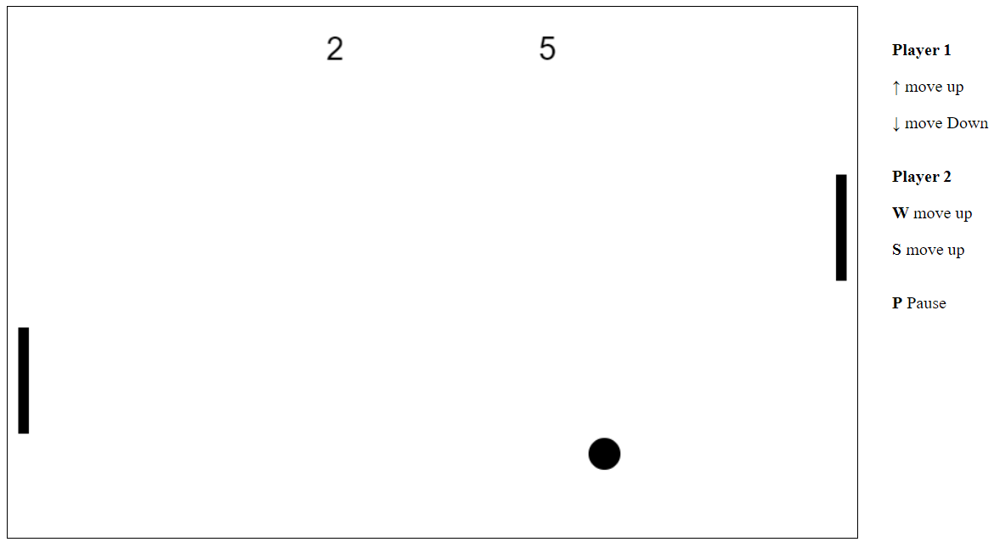

# Pong Game in JavaScript

<h3>A simple hangman game made in JavaScript. The app was made to practice canvas in JS. The game can be played by two players, one use arrow up and down to move platform and the second player use "W" and "S". Button "P" allow to pause and resume game. The points scored by the players are counted at the top of the board</h3>

  

